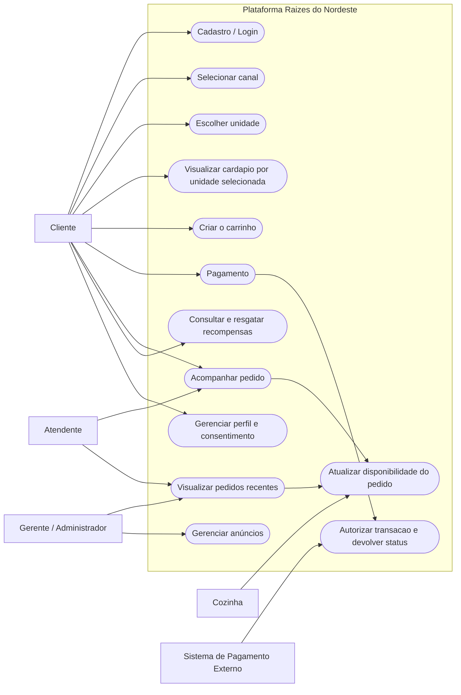

# Diagramas

Este material traz a secao de diagramas do roteiro e onde foi alinhado com os fluxos do projeto Raizes do Nordeste.

# 1. Diagrama de Casos de Uso

## 2. Descricao da Feature Escolhida

### UC 1 - Cadastrar Cliente

**Descricao**  
O cliente revisa os itens adicionados ao carrinho, informa seus dados e escolhe a forma de pagamento . A interface retorna com confirmacao visual, cria o pedido, registra o consentimento e libera o pedido.

**Ator principal**  
Cliente

**Demais atores**  
Sistema de Pagamento, Cozinha e Atendente

**Pre-condicoes**
- O cliente realizou o login ou entrou como visitante temporariamente.
- Selecionou a unidade.
- Selecinou o prato desejado.
- O sistema calculou o total.

**Pos-condicoes**
- O pedido criado.
- O retorno exibido como pagamento aprovado.
- O carrinho limpo.
- Os pontos de fidelidade são creditados a conta do usuário.
- Os consentimentos ficam salvo localmente.

**Origem das informacoes**
- Dados do formulario de pagamento.
- Sessao atual sendo cliente ou visitante.
- Parametros da unidade escolhida.

**Fluxo principal**
1. O cliente acessa a tela de pagamento.
2. O sistema carrega o resumo da compra.
3. O sistema preenche nome, e-mail e telefone com base na sessao atual.
4. O cliente seleciona a forma de pagamento.
5. O sistema mostra a previsao de envio para o pagamento.
6. O cliente confirma os consentimentos obrigatorios do checkout.
7. O cliente aciona Confirmar pagamento.
8. O sistema registra o pedido com status e redireciona para o acompanhamento.

**Fluxos alternativos**
1. Se o carrinho estiver vazio, o sistema bloqueia e retorna ao carrinho.
2. Se algum campo obrigatorio estiver invalido, o formulario nao será enviado.
3. Se ocorrer falha no pagamento, a interface detecta o erro e permite uma nova tentativa.

**Regras de negocio**
- O valor total considera o frete apenas na modalidade e delivery.
- Os dados enviados sao os minimos necessarios para autenticacao do pagamento.
- A confirmacao do pedido so acontece depois da validacao do carrinho.

## 3. Diagrama da Jornada do Usuario

```mermaid
flowchart LR
    A[Primeiro contato na home] --> B{Já possui conta?}

    B -- Nao --> C[Realizar cadastro e aceitar LGPD]
    B -- Sim --> D[Realizar login]
    B -- Visitante --> E[Entrar como visitante temporariamente]

    C --> F[Seleciona canal]
    D --> F
    E --> F

    F --> G[Escolher unidade]
    G --> H[Visualizar cardapio da unidade selecionada]
    H --> I[Adicionar pedido ao carrinho]
    I --> J{Deseja revisar ou continuar comprando?}
    J -- Continuar comprando --> H
    J -- Revisar pedido --> K[Conferir total, frete e pontos]

    K --> L[Preencher os dados]
    L --> M[Escolher o metodo de pagamento e confirmar os consentimentos]
    M --> N[Envio para gateway externo]
    N --> O{Pagamento aprovado?}

    O -- Nao --> P[Exibe falha e retorna]
    P --> L

    O -- Sim --> Q[Pedido confirmado]
    Q --> R[Fila da unidade / atendimento]
    R --> S[Pagamento aprovado em sistema]
    S --> T[Cozinha iniciará o preparo]
    T --> U[Pedido pronto para retirada]
    U --> V{Modalidade escolhida}

    V -- Retirada --> W[Cliente retira]
    V -- Delivery --> Y[Pedido segue para entrega]

    W --> Z[Pontos creditados]
    X --> Z
    Y --> Z
```

